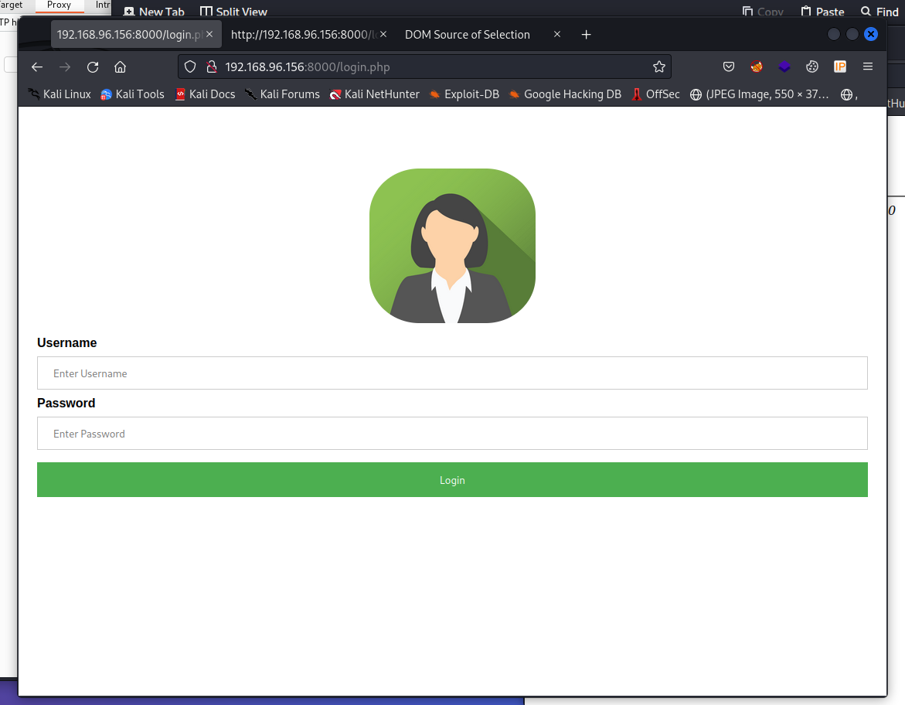
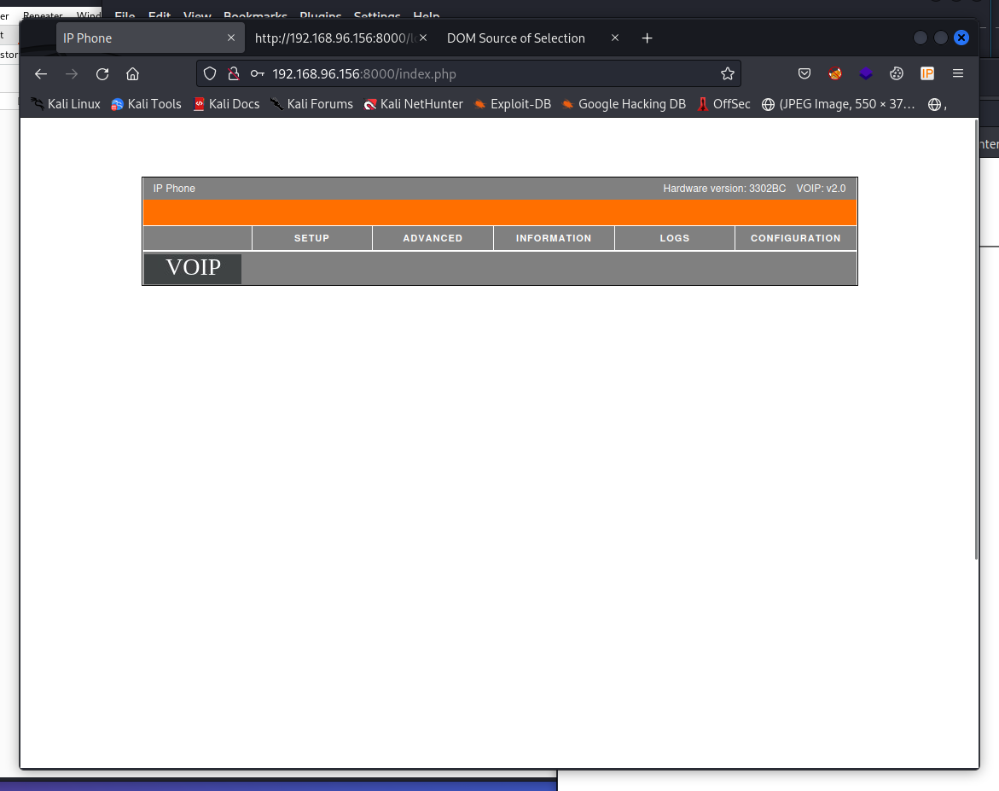
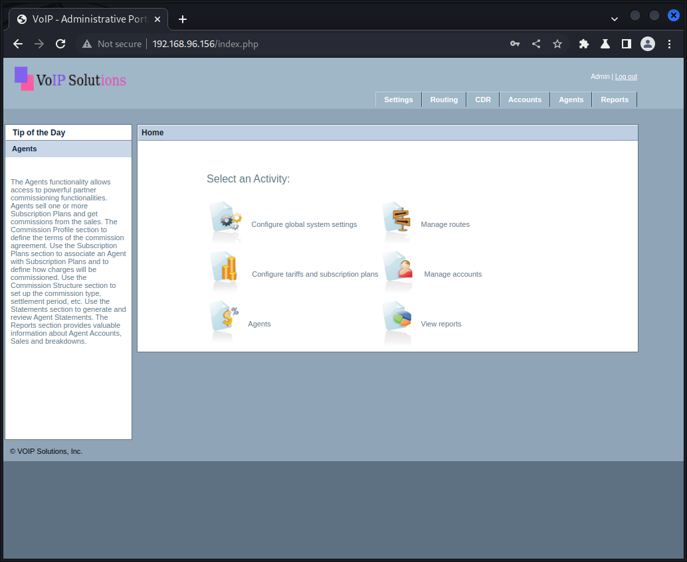
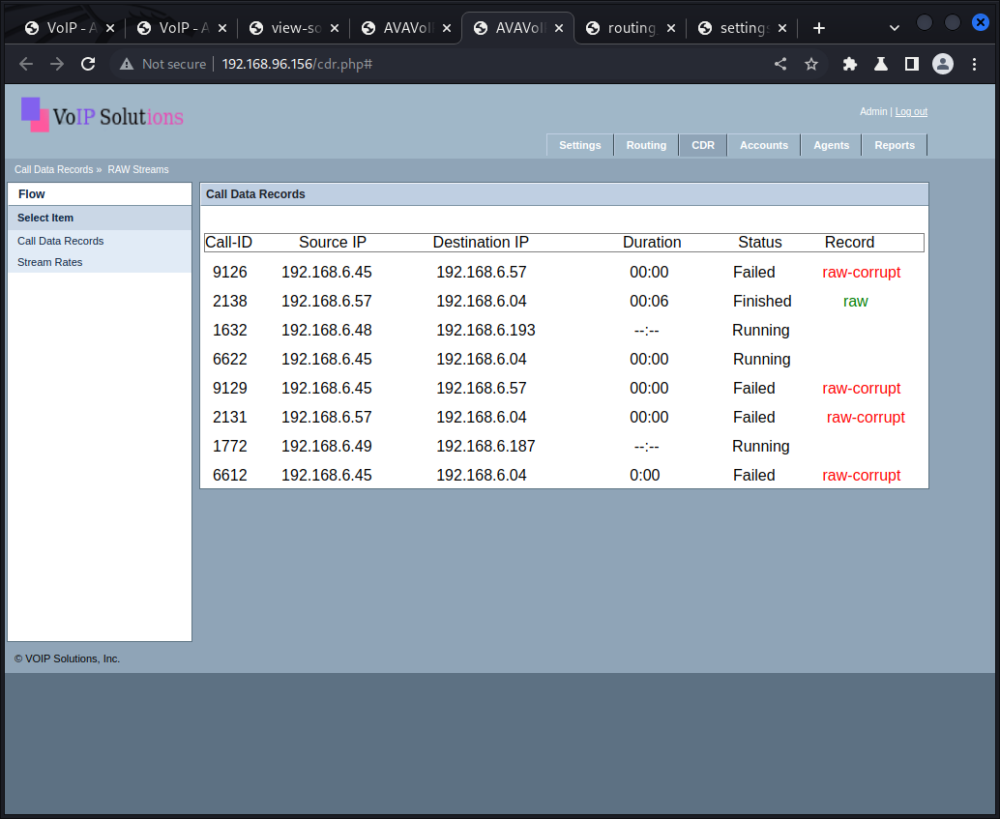

# Main

## Initial

The following is a writeup is for a machine rated as intermediate by offsec and very hard by community. I found the machine to be quite difficult due to infamiliarity with the services and processes necessary, but for that exact reason it was also one of my favorite machines I've done and a fantastic learning experience for me. The name is purposely omitted to allow for me to share my process and methods without spoiling the machine for others and the community. 


## Enumeration 
After starting the machine, service enumeration was performed using a custom bash script that I wrote with the specific use-case of the OSCP labs and exam. The script is ideal for this setting, however I would note that the script is too heavy for use in a production environment and would almost certainly alert blue team engineers of potential malicious activity. With that said, enumeration is essential and in this case, heavy enumeration is required. In the real world, the script could be modified with timing delays and a more targeted approach to make it 'quieter.'

The script starts by using rustscan to check all TCP ports for any non-standard open ports. The results are the used in a more targeted nmap scan. Whatweb and httpx are also used to check for web servers on all detected open ports. Various other functions, such as GoBuster and searchsploit, are then performed depending on the options chosen. For more information about this, the script can be found on my GitHub account: https://github.com/jeremylaratro/pentest_scripts/tree/main

### Port scans:
```
Open 192.168.96.156:22
Open 192.168.96.156:80
Open 192.168.96.156:8000

```

---

### Web - initial:
WhatWeb results:
```
Grabbing banner with whatweb..
http://192.168.96.156 [302 Found] Apache[2.4.41], Cookies[PHPSESSID], Country[RESERVED][ZZ], HTTPServer[Ubuntu Linux][Apache/2.4.41 (Ubuntu)], IP[192.168.96.156], RedirectLocation[login.php]
http://192.168.96.156/login.php [200 OK] Apache[2.4.41], Bootstrap, Cookies[PHPSESSID], Country[RESERVED][ZZ], HTML5, HTTPServer[Ubuntu Linux][Apache/2.4.41 (Ubuntu)], IP[192.168.96.156], JQuery[3.2.1], PasswordField[password], Script, Title[VOIP Manager]


```
GoBuster Results:
```
[+] Url:                     http://192.168.96.156
[+] Method:                  GET
[+] Threads:                 10
[+] Wordlist:                /usr/share/wordlists/SecLists-master/Discovery/Web-Content/raft-medium-directories.txt
[+] Negative Status codes:   404
[+] User Agent:              gobuster/3.3
[+] Extensions:              html,php,txt,js
[+] Timeout:                 10s
===============================================================
2023/02/18 14:54:08 Starting gobuster in directory enumeration mode
===============================================================
/logout.php           (Status: 200) [Size: 11]
/login                (Status: 301) [Size: 316] [--> http://192.168.96.156/login/]
/login.php            (Status: 200) [Size: 4342]
/files                (Status: 301) [Size: 316] [--> http://192.168.96.156/files/]
/index.php            (Status: 302) [Size: 1] [--> login.php]
/server-status        (Status: 403) [Size: 279]
/streams.php          (Status: 302) [Size: 0] [--> login.php]
/.php                 (Status: 403) [Size: 279]
/.html                (Status: 403) [Size: 279]

```
GoSpider Results:
```
[url] - [code-200] - http://192.168.96.156/login.php
[form] - http://192.168.96.156/login.php
[javascript] - http://192.168.96.156/login/vendor/jquery/jquery-3.2.1.min.js
[javascript] - http://192.168.96.156/login/vendor/bootstrap/js/popper.js
[javascript] - http://192.168.96.156/login/vendor/bootstrap/js/bootstrap.min.js
[javascript] - http://192.168.96.156/login/vendor/select2/select2.min.js
[javascript] - http://192.168.96.156/login/vendor/tilt/tilt.jquery.min.js
[javascript] - http://192.168.96.156/login/js/main.js
[linkfinder] - [from: http://192.168.96.156/login/vendor/select2/select2.min.js] - select2/utils
[linkfinder] - [from: http://192.168.96.156/login/vendor/select2/select2.min.js] - select2/results
[linkfinder] - [from: http://192.168.96.156/login/vendor/select2/select2.min.js] - ./utils
t2/select2.min.js] - select2/dropdown/infiniteScroll
[linkfinder] - [from: http://192.168.96.156/login/vendor/select2/select2.min.js] - select2/dropdown/attachBody

...

```

Upon manual enumeration of the web pages found on port 80, a 403 error was encountered:
```
<html><head>
<title>403 Forbidden</title>
</head><body>
<h1>Forbidden</h1>
<p>You don't have permission to access this resource.</p>
<hr>
<address>Apache/2.4.41 (Ubuntu) Server at 192.168.96.156 Port 80</address>﷯

</body></html>
```

The login.php page of port 80, however, was accessible and was a simple login page. 

A few variations of default credentials were attempted without success.

----

The web server running on port 8000 also featured a login page.



 The default credentials of admin:admin were entered and granted entry into what appears to be a portal for a VOIP system interface. 



After accessing the web interface, a potentially identifying source of information was discovered on the top right side of the portal:
```
Hardware Version: 3302BC
```

---

Potential Exploits:

Googling the hardware version found above immediately led to results pertaining to Cisco VOIP systems, along with an [RCE](https://www.google.com/url?sa=t&rct=j&q=&esrc=s&source=web&cd=&cad=rja&uact=8&ved=2ahUKEwiV7L7l75_9AhWDRjABHcBEAA0QFnoECBEQAQ&url=https%3A%2F%2Fthreatpost.com%2Fcritical-cisco-ip-phone-rce-flaw%2F154864%2F&usg=AOvVaw1-NPi43NWUCxWUHbvyAAGG) and [DOS](https://www.tenable.com/plugins/nessus/141192) vulnerability. 

It was not clear, however, what about the hardware version was linking the discovered portal to the exploit discussed, as the version number displayed was not mentioned anywwhere in the article. 
Due to the lack of sufficiently distinct identifiers, I took a screenshot of the web portal and used a reverse image search to try to obtain the name of the software and technology accessed here. This led to multiple results, linking to a D-Link router.

Searching for this led to an [OS command injection vulnerability.](https://www.secpod.com/blog/d-link-dsr-routers-critical-command-injection-vulnerabilities/)

In searching for a potential public PoC for the RCE vulnerability found, only a DoS PoC was discovered. Given the reporting of ability to execute commands, it is likely then that this DoS PoC can be used to form a working RCE exploit. 


---
Recap:

While numerous exploits were discovered, I was not confident that the exploits found were directly related to or applicable to the service found. I decided to do a deep-dive on VOIP pen-testing, something that I was entirely unfamiliar with up to this point, aside from an RCE exploit I had done on a VOIP portal (but not an actual VOIP exploit as it was within the web service). After a bunch of digging, I came across a tool called sippts. Specifically, within this toolset is a python script called [SipDigestLeak.py](https://github.com/Pepelux/sippts/wiki/SIPDigestLeak). Running this script, I was finally able to recover something of use:
```

[✓] Target: 192.168.96.156:5060/UDP

[=>] Request INVITE
[<=] Response 180 Ringing
[<=] Response 200 OK
[=>] Request ACK
        ... waiting for BYE ...
[<=] Received BYE
[=>] Request 407 Proxy Authentication Required
[<=] Received BYE
[=>] Request 200 Ok
Auth=Digest username="adm_sip", uri="sip:127.0.0.1:5060", password="074b62fb6c21b84e6b5846e6bb001f67", algorithm=MD5

 -------------------------------------------------------------------------------------------------------------------------------------------------
| IP address     | Port | Proto | Response                                                                                                        |
 -------------------------------------------------------------------------------------------------------------------------------------------------
| 192.168.96.156 | 5060 | UDP   | Digest username="adm_sip", uri="sip:127.0.0.1:5060", password="074b62fb6c21b84e6b5846e6bb001f67", algorithm=MD5 |
 -------------------------------------------------------------------------------------------------------------------------------------------------

```

Considering the succesful login using admin:admin on the 8000 port webserver, the logical assumption would be that the md5 hash found, if cracked, could likely be the password for the webserver on port 80 which I was previously unable to log into. 

--- 

## foothold

Using hashcat, I was able to quickly crack the md5 hash using my custom wordlist (although it was a simple password, nothing special is required).  
The username and password previously found were entered into the login page of the VOIP manager service and I was soon redirected to an admin panel of the VOIP Solution software.




Searching the webapp, there was no sign of any file upload utility or method of uploading a reverse shell, and a search for any exploits using the software name did not return anything of value. The only thing that seemed to interesting were downloadable files, which seemed to be recordings of calls. Most of them were corrupted, but one was not. Upon playing the file, however, there was nothing intelligible. After some more searching, I was quite stuck so at this point, I decided to look at a hint to ensure that I was at least on the right track, which I did confirm. The objective now was to figure out how to decode one of these raw audio files.  



After researching how to decode or convert raw files, I found a CLI utility called sox with can convert raw audio files into wav files.
Using the following command, I was able to convert the raw audio file to a wav file:
```
└─$ sox -r 44100 -e unsigned -b 8 -c 1 2138.raw test.wav
```

The audio, however, was still just noise with nothing disernable, but I noticed that on the left panel of the page, in a tab called "Stream Rates," was a section called metadata with the following information:

```
Metadata:
encoder : Lavf58.29.100
Stream #0:0: Audio: pcm_mulaw, 8000 Hz, mono, s16, 64 kb/s
```

With the previous sox command, the frequency was set to 44100Hz and 8bits -- the default values. With the new information obtained from the metadata, I used sox to change the frequency to 8000 and the bit rate to 16:

```
sox -r 8000 -e unsigned -b 16 -c 1 2138.raw test2.wav
```
While the audio was still unintelligible, it was clear that I was on the right track as a voice could now be discerned. I realized that my mistake was likely in changing the bit rate to 16, and that I likely confused the s16 with 16bit. I changed it back to 8, and now a very staticy, but intelligible message was now heard. 
```
sox -r 8000 -e unsigned -b 8 -c 1 2138.raw test2.wav

```
The message was quite hard to hear, but seemed to say:
"Your password has been changed to [redacted] ..(unintelligible)"

I tried to ssh into the system using what I could hear, but was unsuccesful, so I decided to go back to sox and attempt to get the audio to export more cleanly. I changed the rate to 9000 and could make out what I believe to be a mention of making one of the letters capital. I could not tell which one, so I decided to start with the most obvious, being the first letter. 

During manual enumeration of the web service running on port 8000, in the information tab there was a submenu with users and their respective IDs. None of the IDs matched with the Call-ID of the audio file. so all of the IDs were used in attempt to log in with ssh, until finally the ****** user authenticated. 


---

## Privilege Escalation

After gaining access to the system with one of the voip users, I ran some initial commands to check for the 'low-hanging fruit' of privilege escalation:
```
find . -perm /4000 2>/dev/null

crontab -e

sudo -l
```
The last command returned promising results:
```
$ sudo -l
[sudo] password for ******: 
Matching Defaults entries for ****** on ###P:
    env_reset, mail_badpass, secure_path=/usr/local/sbin\:/usr/local/bin\:/usr/sbin\:/usr/bin\:/sbin\:/bin\:/snap/bin

User ****** may run the following commands on ###P:
    (ALL : ALL) ALL
$ sudo su
root@V##P:/# id && whoami
uid=0(root) gid=0(root) groups=0(root)
root

```

## Persistence

After gaining access to the root user, persistence was obtained by accessing the ssh rsa private key.


## Recap
This machine was my first experience using VOIP-specific tools and was an amazing learning experience. The attack pathway to reach a foothold on the system was quite difficult since I had never worked with VOIP or audio-processing before, which provided me with a great learning opportunity with something almost entirely new to me. 