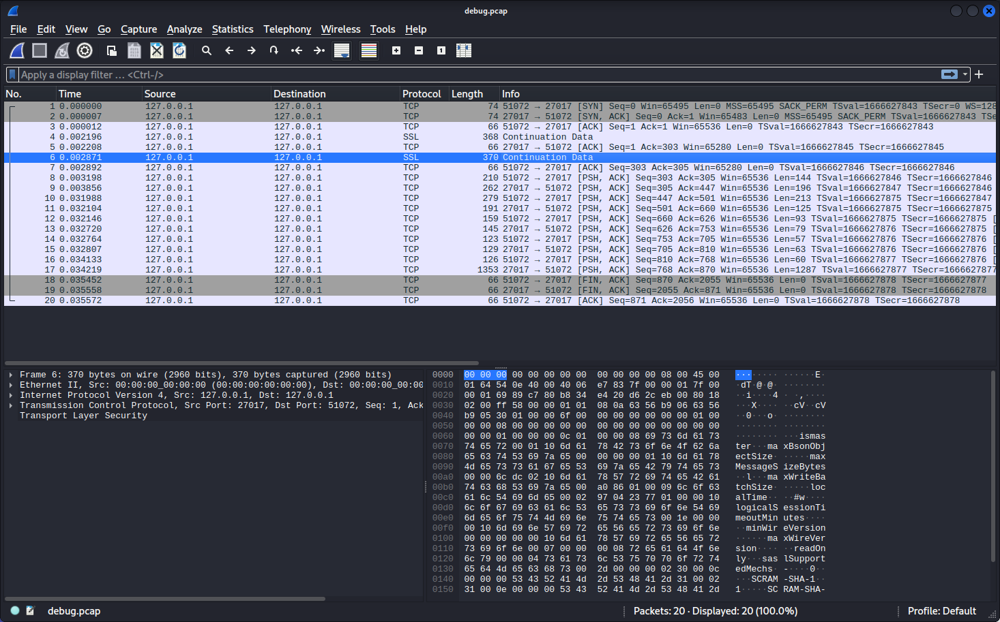

# Chaining CVE-2020-15149 with an Arbitrary File Write vulnerability

> In this writeup, you will read about chaining CVE-2020-15149 with an arbitrary file write vulnerability to gain root access to a linux webserver.

[Back to Table of Contents](../cysec)

---
Note: System name and information like hashes are changed to avoid spoilers. 

## Initial

Initial scanning of the system was performed using my bash automation script which makes use of tools like rustscan, nmap, whatweb, gospider, and gobuster. 

Port scans:
```
PORT      STATE SERVICE    REASON         VERSION
21/tcp    open  ftp        syn-ack ttl 62 vsftpd 3.0.3
| ftp-syst: 
|   STAT: 
| FTP server status:
|      Connected to 192.168.45.5
|      Logged in as ftp
|      TYPE: ASCII
|      No session bandwidth limit
|      Session timeout in seconds is 300
|      Control connection is plain text
|      Data connections will be plain text
|      At session startup, client count was 1
|      vsFTPd 3.0.3 - secure, fast, stable
|_End of status
| ftp-anon: Anonymous FTP login allowed (FTP code 230)
|_drwxr-xr-x    2 ftp      ftp          4096 Feb 01  2021 pub
22/tcp    open  ssh        syn-ack ttl 62 OpenSSH 7.6p1 Ubuntu 4 (Ubuntu Linux; protocol 2.0)
| ssh-hostkey: 
|   2048 8535fbcab34b30d8e58eb325586c6e70 (RSA)
| ssh-rsa AAAAB3NzaC1yc2EAAAADAQABAAABAQDtXHpFK7WIinYk72khOxHjkwHc2VfAlkPEEUYJH+qcg7XRETxE67aA00jkJfZqzutmsPSJaPfzoJi2WNc7wHv3V+Fq2fNR5BVjll0Gnd/l0J6tlSZ5iL80mfZHK0MbSHBG0rY/AtjKkrkSN697K/Ygpivr5uufhLHZpLVXKcnP1GMsO72BPiDzRQ2ncVsV0ZejQ/m1K2DRVTy+xsdx+pft76qnBZprh5RWuJtIsL6fA23fr4pSAiQ4ElS/vHH02DGZ6PRjJYQNREH9kbMgF6VLI1eHpQubz5vx/7o2EwvFmM9LaQ4Gqryfjye/Z8yS6L7DdJCSKAJt3aucOWjem8GJ
|   256 de67a232d5ff566e825b6a177de244ac (ECDSA)
| ecdsa-sha2-nistp256 AAAAE2VjZHNhLXNoYTItbmlzdHAyNTYAAAAIbmlzdHAyNTYAAABBBGE6s/w6Ru4bHrYQLL1yGbhZa/TjQZY2q0bixGR+GF+zIijxexuZ4umQSvnQO018K8WVj73uKTcMwqKHghvSwqE=
|   256 3aa3203b32cd836fdc23a266f90fc6d3 (ED25519)
|_ssh-ed25519 AAAAC3NzaC1lZDI1NTE5AAAAIJ1s5UWvBLLeULmcvB/WiXX+COPZdgnMdJPaAOH/6V+J
80/tcp    open  http       syn-ack ttl 62 nginx 1.14.0 (Ubuntu)
|_http-title: Markdown Editor
|_http-favicon: Unknown favicon MD5: 7706F0D305F7F82674AA0A16B0D7CDC9
| http-methods: 
|_  Supported Methods: GET HEAD
|_http-server-header: nginx/1.14.0 (Ubuntu)
8080/tcp  open  http-proxy syn-ack ttl 62
| fingerprint-strings: 
|   FourOhFourRequest: 
|     HTTP/1.1 404 Not Found
|     X-DNS-Prefetch-Control: off
|     X-Frame-Options: SAMEORIGIN
|     X-Download-Options: noopen
|     X-Content-Type-Options: nosniff
|     X-XSS-Protection: 1; mode=block
|     Referrer-Policy: strict-origin-when-cross-origin
|     X-Powered-By: NodeBB
|     set-cookie: _csrf=hrMx-Bungfc0whtgX5t7gZoh; 
|   HTTPOptions: 
|     HTTP/1.1 200 OK
|     X-DNS-Prefetch-Control: off
|     X-Frame-Options: SAMEORIGIN
|     X-Download-Options: noopen
|     X-Content-Type-Options: nosniff
|     X-XSS-Protection: 1; mode=block
|     Referrer-Policy: strict-origin-when-cross-origin
|     X-Powered-By: NodeBB
|     Allow: GET,HEAD
|     Content-Type: text/html; charset=utf-8
|     Content-Length: 8
|     ETag: W/"8-ZRAf8oNBS3Bjb/SU2GYZCmbtmXg"
|     Vary: Accept-Encoding
|     Date: Fri, 24 Mar 2023 15:08:01 GMT
|     Connection: close
|     GET,HEAD
|   RTSPRequest: 
|     HTTP/1.1 400 Bad Request
|_    Connection: close
|_http-title: Home | NodeBB
| http-robots.txt: 3 disallowed entries 
|_/admin/ /reset/ /compose
| http-methods: 
|_  Supported Methods: GET HEAD POST OPTIONS
|_http-favicon: Unknown favicon MD5: 152FF7D5AE5BDB84B33D4DCA31EB7CD3
11211/tcp open  memcached  syn-ack ttl 62 Memcached 1.5.6 (uptime 3861 seconds; Ubuntu)
27017/tcp open  mongodb    syn-ack ttl 62 MongoDB 4.0.22
| fingerprint-strings: 
|   FourOhFourRequest, GetRequest: 
|     HTTP/1.0 200 OK
|     Connection: close
|     Content-Type: text/plain
|     Content-Length: 85
|     looks like you are trying to access MongoDB over 
1 service unrecognized despite returning data. If you know the service/version, please submit the following fingerprint at https://nmap.org/cgi-bin/submit.cgi?new-service :
SF-Port8080-TCP:V=7.93%I=7%D=3/24%Time=641DBCD0%P=x86_64-pc-linux-gnu%r(Ge
SF:tRequest,3494,"HTTP/1\.1\x20200\x20OK\r\nX-DNS-Prefetch-Control:\x20off
SF:\r\nX-Frame-Options:\x20SAMEORIGIN\r\nX-Download-Options:\x20noopen\r\n
SF:X-Content-Type-Options:\x20nosniff\r\nX-XSS-Protection:\x201;\x20mode=b
SF:lock\r\nReferrer-Policy:\x20strict-origin-when-cross-origin\r\nX-Powere
SF:d-By:\x20NodeBB\r\nset-cookie:\x20_csrf=qn2YPuXnJ8gxs9L_LVTeqfsJ;\x20Pa
SF:th=/\r\nContent-Type:\x20text/html;\x20charset=utf-8\r\nContent-Length:
SF:\x2024233\r\nETag:\x20W/\"5ea9-nkRyIjT4irvn0Z9lPdz2r/k8pgc\"\r\nVary:\x
SF:20Accept-Encoding\r\nDate:\x20Fri,\x2024\x20Mar\x202023\x2015:08:01\x20
SF:GMT\r\nConnection:\x20close\r\n\r\n<!DOCTYPE\x20html>\n<html\x20lang=\"
SF:en-GB\"\x20data-dir=\"ltr\"\x20style=\"direction:\x20ltr;\"\x20\x20>\n<
SF:head>\n\t<title>Home\x20\|\x20NodeBB</title>\n\t<meta\x20name=\"viewpor
SF:t\"\x20content=\"width&#x3D;device-width,\x20initial-scale&#x3D;1\.0\"\
SF:x20/>\n\t<meta\x20name=\"content-type\"\x20content=\"text/html;\x20char
SF:set=UTF-8\"\x20/>\n\t<meta\x20name=\"apple-mobile-web-app-capable\"\x20
SF:content=\"yes\"\x20/>\n\t<meta\x20name=\"mobile-web-app-capable\"\x20co
SF:ntent=\"yes\"\x20/>\n\t<meta\x20property=\"og:site_name\"\x20content=\"
SF:No")%r(HTTPOptions,1BF,"HTTP/1\.1\x20200\x20OK\r\nX-DNS-Prefetch-Contro
SF:l:\x20off\r\nX-Frame-Options:\x20SAMEORIGIN\r\nX-Download-Options:\x20n
SF:oopen\r\nX-Content-Type-Options:\x20nosniff\r\nX-XSS-Protection:\x201;\
SF:x20mode=block\r\nReferrer-Policy:\x20strict-origin-when-cross-origin\r\
SF:nX-Powered-By:\x20NodeBB\r\nAllow:\x20GET,HEAD\r\nContent-Type:\x20text
SF:/html;\x20charset=utf-8\r\nContent-Length:\x208\r\nETag:\x20W/\"8-ZRAf8
SF:oNBS3Bjb/SU2GYZCmbtmXg\"\r\nVary:\x20Accept-Encoding\r\nDate:\x20Fri,\x
SF:2024\x20Mar\x202023\x2015:08:01\x20GMT\r\nConnection:\x20close\r\n\r\nG
SF:ET,HEAD")%r(RTSPRequest,2F,"HTTP/1\.1\x20400\x20Bad\x20Request\r\nConne
SF:ction:\x20close\r\n\r\n")%r(FourOhFourRequest,1508,"HTTP/1\.1\x20404\x2
SF:0Not\x20Found\r\nX-DNS-Prefetch-Control:\x20off\r\nX-Frame-Options:\x20
SF:SAMEORIGIN\r\nX-Download-Options:\x20noopen\r\nX-Content-Type-Options:\
SF:x20nosniff\r\nX-XSS-Protection:\x201;\x20mode=block\r\nReferrer-Policy:
SF:\x20strict-origin-when-cross-origin\r\nX-Powered-By:\x20NodeBB\r\nset-c
SF:ookie:\x20_csrf=hrMx-Bungfc0whtgX5t7gZoh;\x20Path=/\r\nContent-Type:\x2
SF:0text/html;\x20charset=utf-8\r\nContent-Length:\x2015431\r\nETag:\x20W/
SF:\"3c47-vs6aP6cpj6wIo1UEqD4U6zD7eb0\"\r\nVary:\x20Accept-Encoding\r\nDat
SF:e:\x20Fri,\x2024\x20Mar\x202023\x2015:08:01\x20GMT\r\nConnection:\x20cl
SF:ose\r\n\r\n<!DOCTYPE\x20html>\n<html\x20lang=\"en-GB\"\x20data-dir=\"lt
SF:r\"\x20style=\"direction:\x20ltr;\"\x20\x20>\n<head>\n\t<title>Not\x20F
SF:ound\x20\|\x20NodeBB</title>\n\t<meta\x20name=\"viewport\"\x20content=\
SF:"width&#x3D;device-width,\x20initial-scale&#x3D;1\.0\"\x20/>\n\t<meta\x
SF:20name=\"content-type\"\x20content=\"text/html;\x20charset=UTF-8\"\x20/
SF:>\n\t<meta\x20name=\"apple-mobile-web-app-capable\"\x20content=\"yes\"\
SF:x20/>\n\t<meta\x20name=\"mobile-web-app-capable\"\x20content=\"yes\"\x2
SF:0/>\n\t<meta\x20property=\"og:site_name\"");
Service Info: OSs: Unix, Linux; CPE: cpe:/o:linux:linux_kernel


```


---

web - initial:
port 80:
```

ttp://192.168.224.143:80 [200 OK] Country[RESERVED][ZZ], HTML5, HTTPServer[Ubuntu Linux][nginx/1.14.0 (Ubuntu)], IP[192.168.224.143], Script, Title[Markdown Editor], nginx[1.14.0]
Checking for webserver on: 192.168.224.143:8080 
```
port 8080:
```
/admin                (Status: 302) [Size: 36] [--> /login?local=1]
/plugins              (Status: 301) [Size: 181] [--> /plugins/]
/register             (Status: 200) [Size: 18603]
/login                (Status: 200) [Size: 17661]
/uploads              (Status: 302) [Size: 52] [--> /assets/uploads/?v=oljj059n9nk]
/api                  (Status: 200) [Size: 5629]
/assets               (Status: 301) [Size: 179] [--> /assets/]
/Admin                (Status: 302) [Size: 36] [--> /login?local=1]
/tags                 (Status: 200) [Size: 15974]
/users                (Status: 200) [Size: 18656]
/Login                (Status: 200) [Size: 17661]
/recent               (Status: 200) [Size: 25185]
/groups               (Status: 200) [Size: 19060]
```


### Services:
### ftp:

Checking the ftp server with anonymous login, a directory called 'pub' contains a pcap file. The file was then opened in wireshark for analysis. 


The pcap file appears to be a capture of local TCP traffic (127.0.0.1), with a few encrypted SSL transmissions. 



The traffic appears to be related to the mongodb instance running on the system, which was seen earlier during initial network enumeration. The traffic contains references to a mongodb shell, which could prove useful if access is obtainable. 

### memcached
Initial searches for the memcached 1.5.6 do not return much aside from a DoS exploit. It may be possible to develop this into a working exploit to gain access, however, in this case the decision was made to move on to the other services. 

### mongodb
This mongodb version doesn't appear to be directly vulnerable to any known exploits but may be useful later in gaining access, or post-exploit enumeration.

### Web

Moving to the web server for manual enumeration, the web app on port 80 
is a simple markdown editor with not much in terms of attack surface. 


On port 8080, however, a nodeBB forum is running. 


Having done prior challenges with similar software, this appeared to be a likely entrance.

First, basic enumeration was done; a robots.txt page was found and contained a few entries, but none contain anything useful. 
Moving onto the directory bruteforcing results, the /users user list contained only the admin user, so a password attack seemed unlikely,
although common and default credentials were tried with no success. 

---

### Potential Exploits:
https://www.exploit-db.com/exploits/48875
https://www.sonarsource.com/blog/nodebb-remote-code-execution-with-one-shot/
https://www.exploit-db.com/exploits/49813

Searching for NodeBB vulnerabilities, a few are found. Specifically, the one dealing with insecure account validation (account takeover) seemed to best match the criteria of this instance. 

---

### Web admin compromise: 

The account takeover vulnerability mentioned above was exploited by creating a normal user account, logging in, navigating to the password change page, and then intercepting the password change request and modifying the uid from 2 to 1. This effectively tells the back end to change uid 1's password, and in many cases, uid 1 is admin. In this case, we know there is only one other user, and the numbering scheme appears to be a simple progression considering the newly registered user is uid 2. 


It is important to note, however, that randomizing uids is not a fix for this, it is security through obscurity and can be bypassed relatively easily by bruteforcing numbers. Instead, the proper fix is to implement proper account validation, which does not rely on user-modifiable and plaintext data. 

---
### Recap:
With the admin account successfully compromised, the next step was to obtain a shell on the system. 

Generally, when admin access has been gained on a web application, one of the methods of remote code 
execution is to craft a malicious plugin, usually editing or adding a php/related file containing code 
to execute a reverse shell. In this case, plugins can only be loaded from what appears to be a repository 
of valid plugins. It is still possible that this method can be exploited, depending on how those plugins 
are added into the system. If not reviewed, a malicious actor could add a malicious plugin to the 
repository/library and then add it, and also inject other users. This has been seen with various python 
and javascript libraries.  This is beyond the scope of what is possible since the instance is running 
within a VM, for one, and it would also potentially infect real-world users.

---

### Foothold / Root
To gain a foothold on the server, one of the exploits found earlier was used. The script exploits an arbitrary file-write vulnerability 
within the emoji plugin and practically, this vulnerability allows admin+ users to write files to the system. 
While this can be executed in various ways, the public exploit makes use of this vulnerability by writing the 
attackers ssh public key to the .ssh folder.

https://www.exploit-db.com/exploits/49813


The exploit script was successfully run after changing the credentials to 
those that were created earlier using account takeover.


Then, access is as simple as ssh'ing into the system as root, and full compromise has been obtained. 

There appeared to be an issue with tty within the ssh shell, so python was used to stabilize the shell:
```
mesg: ttyname failed: Inappropriate ioctl for device
python3 -c 'import pty; pty.spawn("/bin/bash")'
root@####:~# ^Z
zsh: suspended  ssh -T root@192.168.224.143 -i /home/kali/.ssh/id_rsa
        
┌──(kali㉿kali)-[/#####]
└─$ stty raw -echo; fg
```


With root access, enumeration for 'loot' began. The user hashes were pulled from /etc/shadow 
and an attempt to crack them with hashcat and a custom wordlist was made, however they could not be cracked. 

```
root:$6$oOJ0a3Lf$HQKSldFZhmoXIKvlulifvmnnwp89q5b3q5wnBmPVyFisbMxVCz9SJfEcl9hxv6xu5farQZxgRMQqHxsQdL2rm0:18659:0:99999:7:::

mike:$6$iKlfpC5n$/9Z5O.ARgHqDilI3rB9Vpkotxwcv68puco4yDXyquNrjcJDF/LXUzw94EvFhDjLqViuln72G6EWP3VUzBTbIN1:18659:0:99999:7:::

```

This writeup demonstrates the dangers of allowing outdated software to run. In this case, two separate vulnerabilities both effected
the same software, allowing the attacker, or in this case, me, to leverage them and gain root access with persistence via ssh. This
also demonstrates the importance of patching, even when the vulnerability does not seem to be overly dangerous. In this case,
only two exploits were used, but sometimes exploit chains become extremely long and complex and leverage otherwise meaningless vulnerabilities
into much larger and serious ones. 

If running NodeBB on an older version, specifically 1.12.2-1.14.2, remediation can be as simple as updating to the latest version.