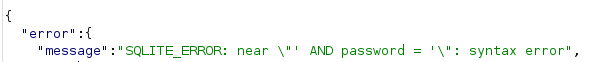
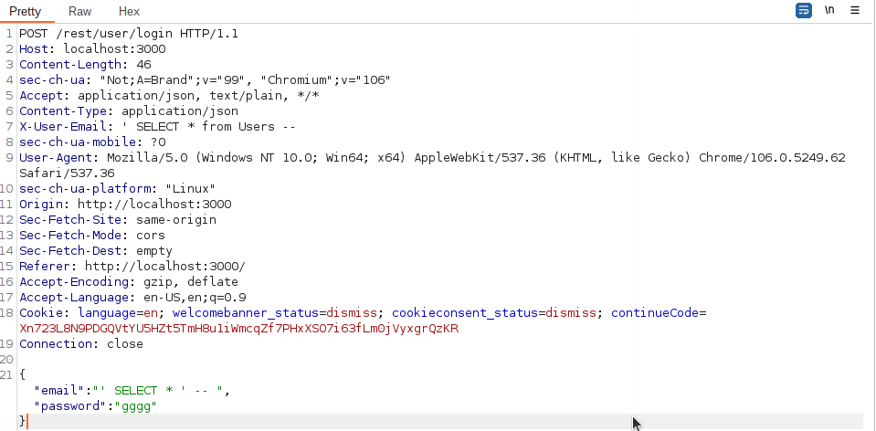
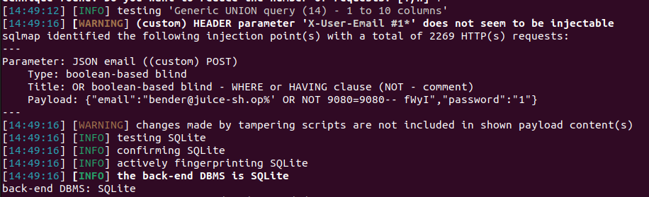
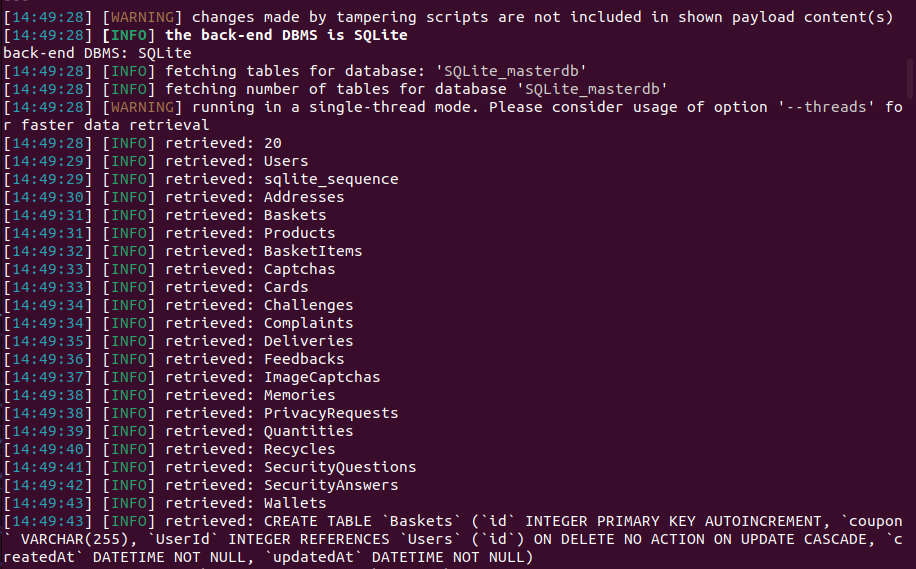
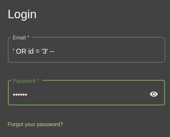
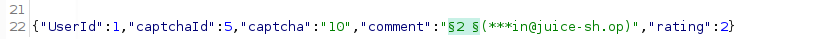
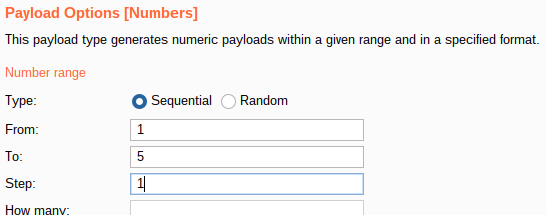
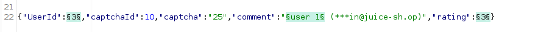

# **OWASP Juice Shop**
[Return to CS page](/CS/cysec)


---
>>## **Description**
> OWASP Juice Shop is an intentionally vulnerable web app containing all the OWASP Top 10 vulnerabilities
> which are essential in cybersecurity as they are common vulnerabilities found in the real world.
> The web app uses Node.js and is written in typesecript, along with a REST API. On top of the vital OWASP Top 10-related 
> experience the app provides, it also provides familiarity with the Node.js platform and the REST API,
> both of which are extremely common and thus, is another essential skill in today's internet and cybersecurity landscape. 
>
> This page will contain my personal notes and experiences with the OWASP Juice Shop web app.

---

>>## **Installation**
> OWASP Juice Shop can be used in numerous ways. The app can be accessed online via TryHackMe, it can be hosted via cloud
> with Heroku (or any other cloud provider), and it can also be served locally using Docker or via Node directly.
> 
> I use both TryHackMe, in order to complete the different labs, and I also locally serve the app
> using Node.js to explore the app and take my time learning in a non-timed and more easily accessible manner. 
> [Juice Shop is available on Github](https://github.com/juice-shop/juice-shop) -- Just don't cheat and look at the
> source code.

```angularjs
git clone https://github.com/juice-shop/juice-shop.git
cd juice-shop
npm install
npm start
Open browser to http://localhost:3000
```

---

>>## **Start**
> With the app running, we can start exploring and understanding structure and
> general function.
> The first thing I did was:
> - Open Burp Suite
> - Look at the site in the browser and use the developer tools to see some of the processes and requests
> - Run dirb to enumerate directories
> 
> The network tab in developer tools shows that the site is interacting with the REST API for various functions. 
> 
> - /api/Challenges/?name=Score Board
> 
> - rest/products/search?q=  --> q parameter may be injectable 
> 
> - /api/Quantitys/
> 
> - main.js
>
> 
> Running dirb results in few results, but one of them is a directory called /ftp.
> This directory contains some interesting files, and access to this directory is
> likely a broken access control vulnerability to begin with. 
> 
> Enumeration of the site also lead me to the /administration panel, although a 403 error is returned and this is 
> presumably only available to the admin user. 
> 
> One of the THM challenges is to find the Juice Shop score board, and using the /api/Challenges/?name=Score Board
> endpoint which I found earlier, a few tries leads to:
> ```html
> /#/score-board
>```
> 
> > ### **/ftp**
> 
> Some of the files appear to be backups, but upon trying to download them we are 
> met with an error stating only pdf and markdown files can be downloaded. This is an opportunity to
> test for a bypass vulnerability.
> - Try appending .md or .pdf --> doesnt work
> - Try adding null nyte byte, %00 to evade filter -->  %00.md or %00.pdf --> doesnt work
> - Try URL encoding the null byte: %2500.md or %2500.pdf --> this works!
>
> The files in ftp contain useful info: 
> - suspicious_errors.yml tells us detection filters for the site, which can save us time in knowing what not to waste time on, and on the flip side, what to try. 
> - coupons_2013.md.bak: contains coupon codes which may be useful later
> - eastere.gg contains a string labeled as the "real easter egg" which may be a directory, file name, or other useful info
> - an encrypted announcement file, accouncement_encrypted.md, exists, along with the byte code of what appears to be the python encryption script (encrypt.pyc), this may be useful in reverse engineering the encryption and decrypting the file. 
> - A file called incident-support.kdbx exists and downloads without null byte, which is interesting, and contains on-unicode characters which may be able to be decoded.
> - A directory called quarantine containing supposed malware
---
> **The 'easter egg'**
> 
> The string appears to be encoded and looks like base64:
> ````
> > L2d1ci9xcmlmL25lci9mYi9zaGFhbC9ndXJsL3V2cS9uYS9ybmZncmUvcnR0L2p2Z3V2YS9ndXIvcm5mZ3JlL3J0dA==
>````
> Using cyberchef, the string decodes to:
> ````
> /gur/qrif/ner/fb/shaal/gurl/uvq/na/rnfgre/rtt/jvguva/gur/rnfgre/rtt
> ````
> This appears to be a path, but the page seems empty. Inspect element shows that the page does contain some info, although
> nothing useful as of now. The page will be noted for later. 
---
> **The coupons**
> 
> The next thing I wanted to try were the coupon codes. I created an account 
> and attempted to use the coupon codes, however they were not valid. 
>  My next thought was to attempt to decode the pattern and potentially craft a valid coupon,
> as they seemed to be potentially encoded strings, 
> 
> I was unable to discern any pattern (for the first 5 characters) for the coupons, however all of them end with the same string:
> - gC7sn 
> - The first letters seem to be in alphabetical order, from j to p.
---
> **The encrypted announcement**
> 
> I downloaded the python bytecode file using the nullbyte vulnerability, restored the extension, and then decompiled the file
> which resulted in the following code:
> ```python
> confidential_document = open('announcement.md', 'r')
> N = 145906768007583323230186939349070635292401872375357164399581871019873438799005358938369571402670149802121818086292467422828157022922076746906543401224889672472407926969987100581290103199317858753663710862357656510507883714297115637342788911463535102712032765166518411726859837988672111837205085526346618740053L
> e = 65537
> encrypted_document = open('announcement_encrypted.md', 'w')
> for char in confidential_document.read():
>    encrypted_document.write(str(pow(ord(char), e, N)) + '\n')
>
> encrypted_document.close()
> ```
> My first thought is that this is RSA encryption, given the "n" and "e" variables. At this point I'm not sure whether I can reverse engineer this without more info,
> so I decided to move on and save this for later. 
---
> **The incident support file**
> 
> I wasn't sure what this file was and googled the extension, which led me to KeePass, a password management software.
>  I downloaded the software version for Linux and attempted to open the file, but the contents were not readable. I
> also tried changing the extensions and running the cat command but was unable to obtain any information from the characters. 
> 
---
> **SQL Injection**
> 
> I decided to move onto the login page of the website and check for SQL vulnerabilities.
> 
>  Starting with a simple test, I entered:
> ````
>  '   
> ````
>into the email field and the app returned [object Object].
> 
> This confirmed potential explotability, as did the response viewed in Burp Suite,
> which shows that we are working with error-based SQLi.
> >  
>
> This can make crafting a working injection much simpler as you can 
> leverage the errors to create a proper injection.
> 
>I continued using some basic SQL commands, and the command:
> ```SQL
>   ' OR true -- 
> ```
> ended up bypassing authentication and signing me in as the admin user. This also allows
> me to complete the admin panel challenge, at /#/administration.
> 
> I continue to try manually testing for other SQL injections, and found that:
> ```SQL
>  ' UNION SELECT * FROM users --
> ```
> also allowed me to log in as the admin user.
>
> After testing out various other basic SQL commands to get an idea for which parameters are vulnerable,
> I moved onto attempting a more efficient and complete exploit of the database using SQLMap. 
> 
> At first, I tried using a simple command:
> ```bash
> sqlmap -u localhost:3000/# --data="email='admin@juice-sh.op',password='pass" --random-agent 
> ```
>  Due to use of the API, I thought it would be better to instead use the  
> '-r' switch which allows you to direct SQLMap to a file containing an intercepted request.
>
> I simply copied the login request (below) and saved it to a file using text editor. 
> > 
> 
> This did not work either, and found that I was receiving an authorization error. 
> 
> Two things came to mind at this point -- the web app uses the base path address/# for most pages, but the request I 
> copied did not contain the #, so I added this into the request. This still did not work.
> 
> The second idea was that perhaps the 401 error that sqlmap could be bypassed, so I added '--ignore-code 401' to
> my SQLMap command, and it still did not work. 
> 
> Finally, I added --level 5 / --risk 3 and --tamper space2comment to the command, and it worked!
> > 
> 
> The final command was:
> ```bash
> sqlmap -r bs2 -p email --level 5 --risk 3 --tamper space2comment --ignore-code 401
> ```
>  After confirming the vulnerability, I added the --dump switch to dump the entire database. 
> > 
> Other useful switches in this case would be --thread {number} to increase the speed, as well as --dump-all. 
> 
> After analyzing the tables from the database, I found that no passwords or hashes were stored, so 
> two of the challenges using injection were still not solved and require manual SQL injection (log in as two specific users - bender and jim).
> 
> I went back to the log in page and started trying other SQL commands to log in as the other two users.
> 
> After trying a bunch of different commands and analyzing the error messages in Burp, I found that: 
> ```SQL
> ' OR id='{num}'--
> ```
> > 
> 
> allows me to log in as any user, where {num} is the id of the user. 
> 
> This basically completed all of the SQLi challenges. 
---
> > **XSS: Cross-Site Scripting**
> 
> The next challenge was to perform a DOM XSS exploit using the iframe tag.
> ```html
> <iframe src="javascript:alert('xss')"/>
> ```
> 
---
> > **CAPTCHA ByPass**
> 
> CAPTCHA is commonly used today to ensure that the site visitor is human. One of the challenges for Juice Shop is to bypass the CAPTCHA and leave a large number of 
> customer feedback comments. We can do this by intercepting a feedback submission in Burp Suite, sending it to Intruder,
> and then simply adding the payload to the parameter. In this case, I simply used a list of numbers, 1 - 21, as the payload. 
> 
>>
> 
> Using this method, it would also be possible to change which CAPTCHA is used, the UserID who sent the feedback, and also the rating.
>> 
> 
> >  
> 
> > **OSINT**
> The challenge is to deduce the security question answer for user "Emma" using the photo they posted to the wall. 
> 
> This one had me stumped for quite a while; my first thought was to use a reverse image search, and I was immediately able to find the location of the photo, which 
> happens to be a building in the Netherlands related to a company called "Mullener + Mullener." I thought I had the answer here, but after trying countless combinations of that company
> name, taking into consideration case sensitivity, nothing worked. Then, I quickly tried using exiftool to see if the answer was in the metadata, but nothing relevant was found.
> I went back to the photo and noticed an address sign on the building, so I went to Google Images streeth view and saw a few company names on the building. Again, I tried 
> combinations of these names, but nothing worked. Finally, I went back to the original image to make sure I was looking at the right building and I noticed a 
> a small piece of paper in the window. I zoomed in and saw "ITSec" -- thats it! The password reset worked. 
## To Be Continued...
> More XSS, broken access control/anti-automation/authentication, cryptographic issues, insecure deserialization, security misconfiguration, and more!
> 
> 
> 