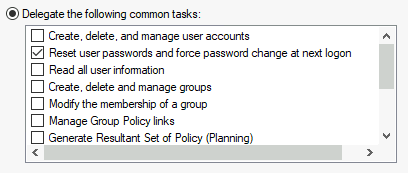
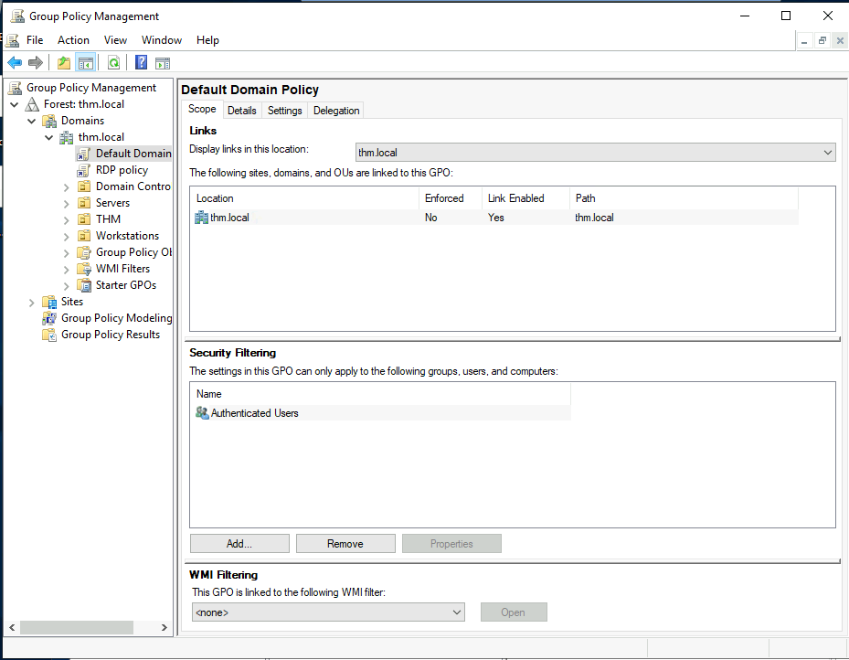
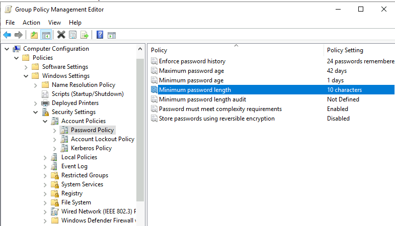
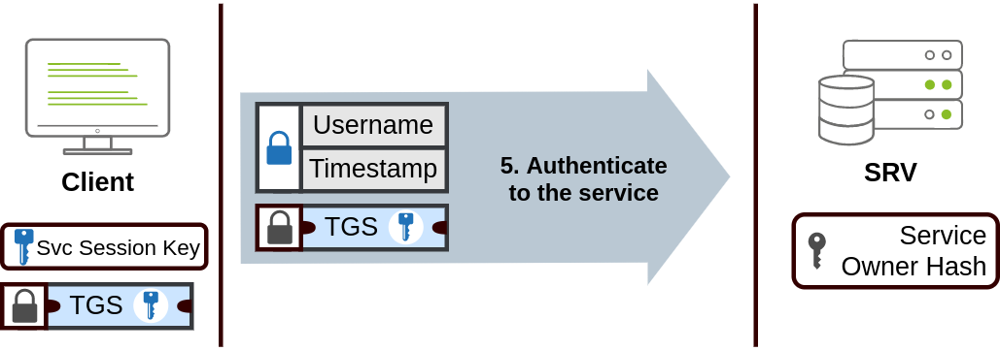

# Active Directory

---

[Back to Table of Contents](../cysec)

># Overview

|     |     |
| --- | --- |
| **Organization** | **Description**|
|OU: Organizational Units | bulk application of policy to users |
|Security Groups | grant permissions to resources |


---


|     |     |
| --- | --- |
| **Security Group** | **Description** |
| Domain Admins | Users of this group have administrative privileges over the entire domain. By default, they can administer any computer on the domain, including the DCs. |
| Server Operators | Users in this group can administer Domain Controllers. They cannot change any administrative group memberships. |
| Backup Operators | Users in this group are allowed to access any file, ignoring their permissions. They are used to perform backups of data on computers. |
| Account Operators | Users in this group can create or modify other accounts in the domain. |
| Domain Users | Includes all existing user accounts in the domain. |
| Domain Computers | Includes all existing computers in the domain. |
| Domain Controllers | Includes all existing DCs on the domain. |


----

># Delegation

Control ---to--> User ---over---> OU

Specific users can be granted specified control over specified OUs.
Ie., IT Dept having control to reset a low-privileged users password. 



---

Powershell:

|  |   | |
| --- | --- | --- |
| Syntax | Set-OPTION username -OPTIONS |
| Type |Command | Options |
|      |Set- | ADAccountPassword, ADUser |
| Password    | -Reset, -ChangePasswordAtLogon, Identity, -NewPassword | (Read-Host -AsSecureString - Prompt 'prompt') |
| Boolean  | $true, $false | |
| Information | -Verbose | | 
| Prompt Options | 

---

```powershell
Set-ADAccountPassword username -Reset -NewPassword (Read-Host -AsSecureString -Prompt 'New Password') -Verbose
```


```powershell
Set-ADUser -ChangePasswordAtLogon $true -Identity username -Verbose
```


---

|  |  |
| ---| ---|
| Computers | |
| Type    | Rep |
| Workstations | PC, LPT |
| Servers | SRV |
| Domain Controllers | DC |


- Recommended to keep servers and workstations in different OUs
---
### GPOs
Group Policy Objects (GPO). GPOs are simply a collection of settings that can be applied to OUs. GPOs can contain policies aimed at either users or computers, allowing you to set a baseline on specific machines and identities.



GPO policy's can be edited, causing systemwide policies to be enacted.
Ie., changing password poluicy -- increasing the minimum length (below)



Policy changes may not be immediate. Changes can be force applied, immediately, to specific computers:

```powershell
gpudate /force 
```

GPO can be used for local security policy too -- ie restricting access to task manager or control panel. 

## GPO distribution

GPOs are distributed to the network via a network share called SYSVOL.

- SYSVOL is stored in the DC. 
- All users in a domain should typically have access to this share over the network to sync their GPOs periodically. 
- The SYSVOL share points by default to the C:\Windows\SYSVOL\sysvol\ directory on each of the DCs in our network.

---
# Protocols

    - Kerberos: Used by any recent version of Windows. This is the default protocol in any recent domain.
    - NetNTLM: Legacy authentication protocol kept for compatibility purposes.
	

## Authentication
### Kerberos

1. Encrypted username and timestamp using key derived from password to KDC (Key Distribution Center)
2. KDC creates, returns TGT (Ticket Granting Ticket) and Session Key
3. TGT allows user to request TGS (Ticket Granting Service) by sending TGT, SPN (Service Principal Name), and username, timestamp encrypted with session key 
	 - SPN indicates desired service and server name to access
4. KDC returns TGS, Service Session Key
	- TGS encrypted using key from Service Owner Hash
	- Service Session Key is used to authenticate to the desired service
	- Service Owner = account that service runs under
	- TGS contains Service Session key, which Service Owner can decrypt and access
6. TGS sent to desired service
	- authenticate and establish connection
	- account password hash used to decrypt TGS and validate Service Session Key 




## NetNTLM Authentication
- challenge-response mechanism
- user password/hash never transmitted


