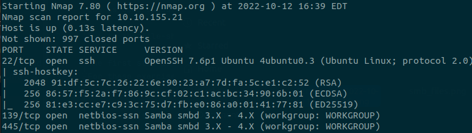
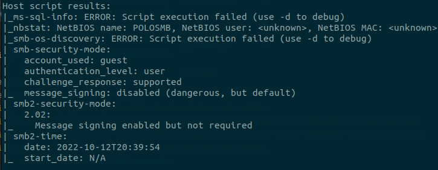

## **SMB : Server Message Block**
>### Notes from TryHackMe, HackTheBox, and other online resources. 
 
 [Back to Table of Contents](../cysec)

SMB is a network-based file sharing protocol that allows users to access shared files on a server.  
SMB is used on both Windows and Unix systems; common services names include microsoft-ds for Windows-based system and Samba for linux-based systems. 

Due to the file-sharing properties of SMB, it is a common attack vector and can lead to serious information breaches if not properly configured and/or secured. 

-----------------

### **Scan**

The first step is to determine whether SMB is running on the target machine. \
For these exercises, I used nmap to scan the target machines to find any potentially vulnerable services. 
    
```bash
sudo nmap {target_ip} -sV -sC -O
```

The nmap scan shows that 3 ports are open on the target machine, with two of them being SMB ports. \


The scripts switch also returned extremely useful information about the specific SMB configuration that this machine is running. 



With just this single nmap scan, we already know of two SMB ports that are open, the system name, the security configuration
(guest has user access), as well as an open ssh port, which may prove useful later. 

-----------------

### **Enumerate**

We can now focus on the SMB service specifically; first to enumerate the system, and then to dig deeper, making use of guest access
and potentially attempting privilege escalation or pivoting to other services in order to obtain the sensitive information, or in this case, the flag.

There are two main methods of enumerating SMB (that I am familiar with):
 - Enum4Linux
 - smbclient

Smbclient is a simple CLI tool which allows interaction with the SMB service, while Enum4Linux goes much more 
in depth in scanning and enumerating the system for everything from users to workgroups. 

I am using both in order to gain more experience using them.

Enumerate and list the shares:
```bash
smbclient -L {target_ip}
```


Three shares are listed, and the profiles share seems to be both interesting and accessible, so that was my first choice to dig into. 

I also ran [Enum4Linux](https://github.com/CiscoCXSecurity/enum4linux) to see what additional information I can obtain. 
```bash
perl enum4linux.pl -a {target_ip}
```
This provided a bunch of information, verifying the smbclient and nmap findings and also providing addition information such
as users.


With this information, I proceeded to attempt access to the profiles share.
```bash
smbclient \\\\{target_ip}\\profiles
```
This was successful, and I was able to list the files in the share.


After looking through the files and directories, I was able to find some interesting information. 
The working from home file contained an HR email telling a user with username cactus that ssh access was provided, 
and the ssh directory contained rsa keys. 


-----------------

### **Pivoting**

With the user's ssh rsa keys, I then attempted to ssh into the machine. 
```
The authenticity of host '10.10.155.21 (10.10.155.21)' can't be established.
ED25519 key fingerprint is SHA256:IiPAreH3/zvA2edHv44DY7aO0feb2/pHmNR7B1VK7+o.
This key is not known by any other names
Are you sure you want to continue connecting (yes/no/[fingerprint])? yes
Warning: Permanently added '10.10.155.21' (ED25519) to the list of known hosts.
@@@@@@@@@@@@@@@@@@@@@@@@@@@@@@@@@@@@@@@@@@@@@@@@@@@@@@@@@@@
@         WARNING: UNPROTECTED PRIVATE KEY FILE!          @
@@@@@@@@@@@@@@@@@@@@@@@@@@@@@@@@@@@@@@@@@@@@@@@@@@@@@@@@@@@
Permissions 0644 for 'id_rsa' are too open.
It is required that your private key files are NOT accessible by others.
This private key will be ignored.
Load key "id_rsa": bad permissions
```

This was not successful, but the warning message:
```
Permissions 0644 for 'id_rsa' are too open.
```
was vital, and after:
```bash
chmod 600 id_rsa
```
I was able to successfully ssh into the machine, and a simple ls -> cat smb.txt provided the flag. 

-----------------

### **Insights**

Obviously, this was simple due to the serious security misconfiguration, however the underlying process
is valid and can be applied in conjunction with other tools and techniques.  \
For example. if the guest user did not have user-level access, the specific smb version, which nmap provided, could be used 
to find specific exploits. Metasploit also contains various SMB exploits, so the scanning information could be used
to craft a more advanced attack.

-----------------

#### **Important Commands**

````bash
smbclient -L ip 
````

```bash
perl enum4linux.pl -a ip
```

```bash
smbclient \\\\ip\\share
```

```bash
smbclient \\\\ip\\share -U username
```


